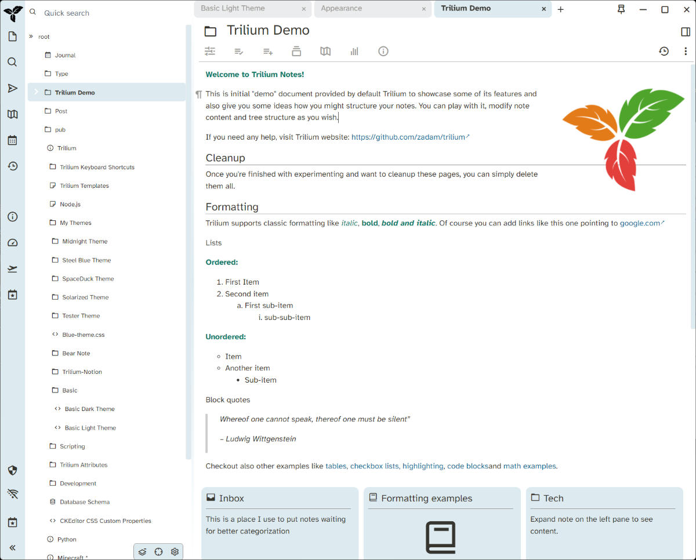
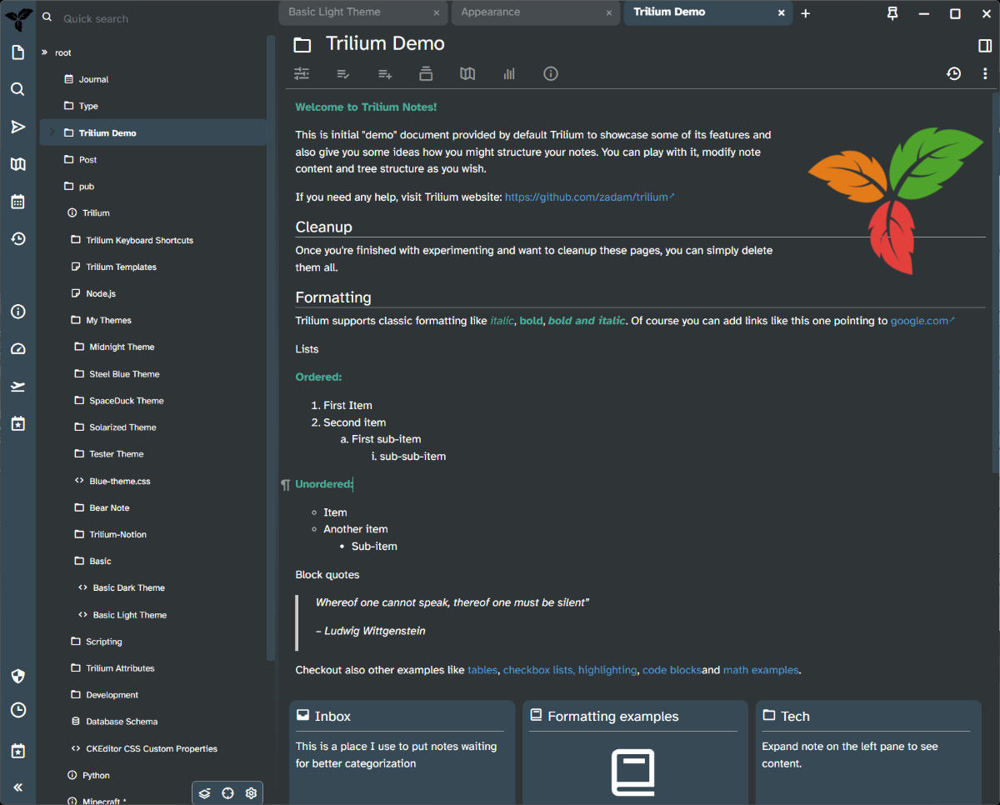

# Basic Trilium Themes

Make [Trilium][trilium] look like basically every startup's Web app with system font stack and Notion colors.

[trilium]: https://github.com/zadam/trilium

Licensed under GNU AGPL, since that's the Trilium license and I spent a good long amount of time directly working from the application's original CSS sources.

## Screenshots

Light version:



and dark version:



## Setup

I am using the stable release of Trilium — currently 0.60.4 — so who knows if this theme will work in the beta? Heck, I only just got it working more or less for me personally.

Basic user flow:

[wiki-themes]: https://github.com/zadam/trilium/wiki/Themes#custom-css-themes

- copy the preferred CSS file content from `build/theme` into custom CSS notes
  - see [Custom CSS Themes][wiki-themes] in the wiki for a guide
- label your CSS note as an app theme; i.e. `#appTheme="Basic Dark"` or `#appTheme="Basic Light"`
- Set Menu → Options → Appearance → Theme to your new CSS note

Basic development flow:

```bash
npm install -D
```

- build it
- Copy the CSS file contents into a Trilium CSS note
- Set note property to something appropriate `#appTheme="Basic Dark"`
- Set Menu → Options → Appearance → Theme to your CSS note

On further iterations, `C-r` to refresh the theme.

```bash
npm run build
```

## Quality control

```bash
npm run lint
```

`.stylelintc.json` has been configured for SCSS, with a few rule adjustments to account for `.CodeMirror` and similar externally defined classes.

## My plans

No big plans. Refactor at my leisure, apply suggestions or requests that fit in with how I want the theme to look, fix egregious bugs. I just want to see how significantly Trilium's look and feel can be tweaked with a little effort.

## License

Trilium Basic Themes — stylesheets for the Trilium note application
Copyright (C) 2023 Brian Wisti <brianwisti@pobox.com>

This program is free software: you can redistribute it and/or modify
it under the terms of the GNU Affero General Public License as published
by the Free Software Foundation, either version 3 of the License, or
(at your option) any later version.

This program is distributed in the hope that it will be useful,
but WITHOUT ANY WARRANTY; without even the implied warranty of
MERCHANTABILITY or FITNESS FOR A PARTICULAR PURPOSE.  See the
GNU Affero General Public License for more details.

You should have received a copy of the GNU Affero General Public License
along with this program.  If not, see <http://www.gnu.org/licenses/>.
